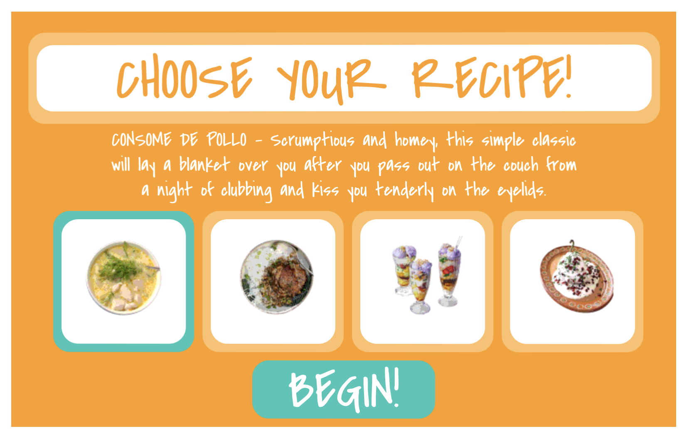
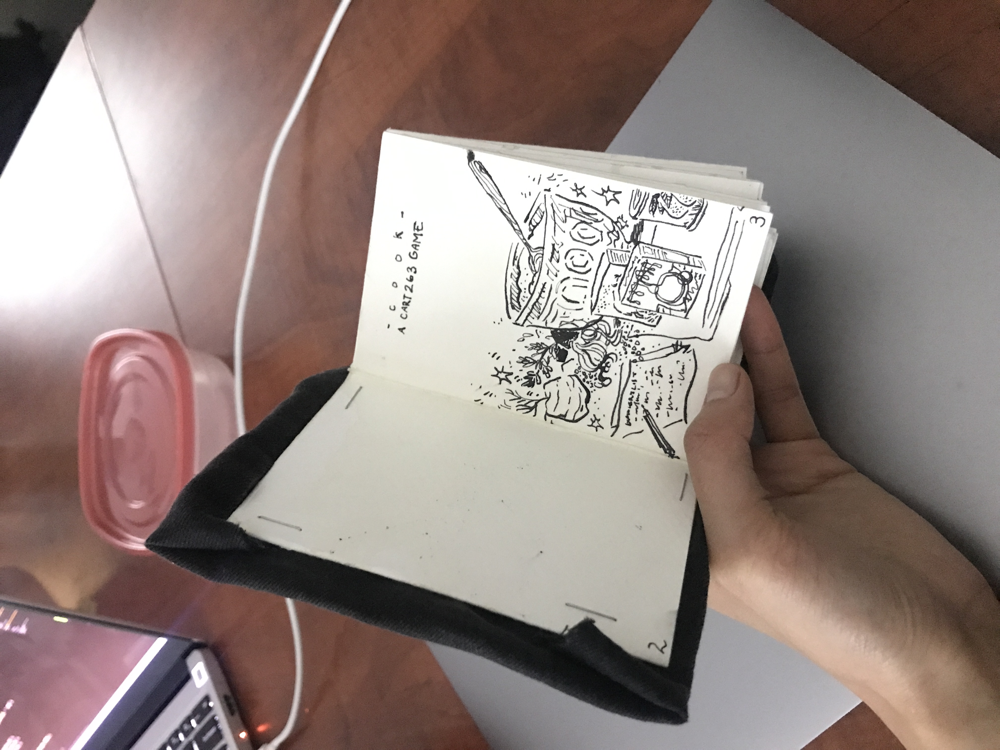
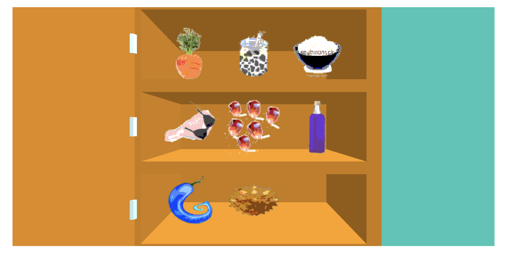
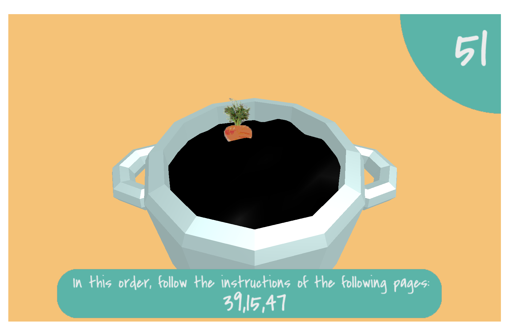
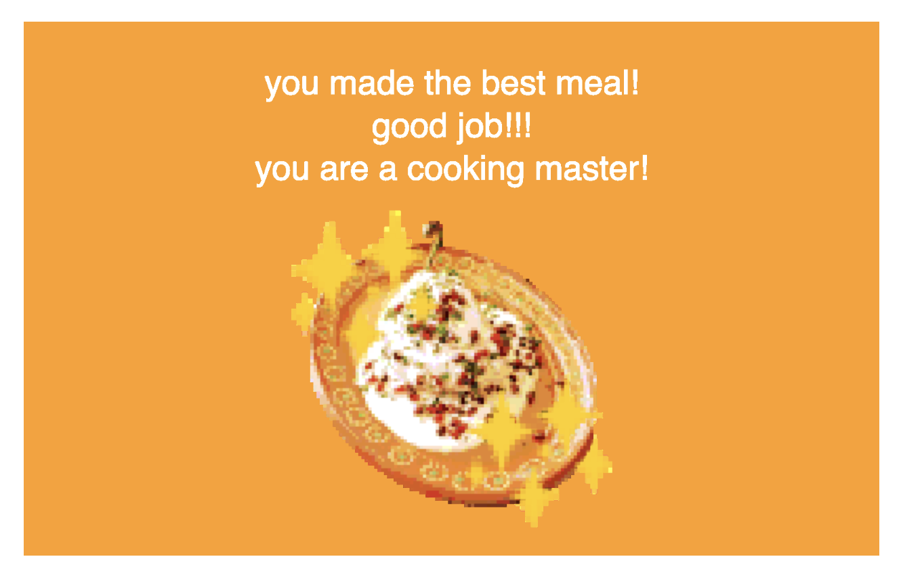

# c o o k

CART 263, Creative Computation II, Winter 2023
Concordia University
Aurora Becerra Granados & Abigail Lopez







### Intro:
For our final project, we've made an asymmetric, multiplayer cooking game simply called "c o o k". The game is played with two players who have to work together and communicate in order to follow a game-generated recipe. 

Player 1 is given a physical cookbook. On each page, there is an ingredient that must be added and a hint as to what the ingredient might look like. Upon choosing a recipe, the game will randomly generate a series of page numbers that will correlate to the ones in the cookbook; Player 1 must flip to those pages in the given order, and communicate the instructions/descriptions/hints to their partner.

Player 2 is given a personal device. On it, is a set of whimsical, confusing, nonsensical and ultimately unrecognizable ingredients. They must listen to Player 1's instructions and select the correct ingredients in the correct order.

There is also a shared screen that both players can look at. It displays the game-generated page numbers that Player 1 must flip to, and also a pot with the ingredients floating around in it. Depending on how many ingredients the players have gotten wrong, the pot also serves as live feedback, shifting to more and more unnatural colours as the players mess up.

While we drew from our own heritages and chose primariliy Mexican and Filipino dishes and occasionally using Spanish and Filipino names for the ingredients, even if some players may have familiarity with the translations, the ingredient assets themselves are very devoid from their real life counterparts, so they must rely on the hints in order to figure out the correct ingredient. We wanted to emulate those stressful feelings that come with things being lost in translation, being unfamiliar with our personal cultural background, and cooking in general. 

-------------------------------------------------------------

### Installation/Run:
In order to play the game, you need two laptops with the file downloaded on both, a copy of the cookbook (included in the 'cooking things.txt' file), and to download the MQTT library (which is already included upon downloading this project off of GitHub).

The laptop meant to be the shared screen should have:
```
<script src="pot.js"></script>
```
in line 13 of the index.html file. 

The laptop meant to be Player 2's screen should have:
```
<script src="pantry.js"></script>
```
in line 13 of the index.html file.

When both players want to start the game, open it up on your respective IDE (we're using Visual Studio Code) and go live on both ends!

-------------------------------------------------------------

### Future iterations:
In terms of our selection, we originally had the idea of having Player 2's screen be on a phone. We also wanted the selection to be much more whimsical; in order to send ingredients, Player 2 had to swipe on their screen and "shoot" the ingredients towards the pot.

We also wanted to add more ingredients, either as decoys or as ingredients themselves but sadly didn't get to finish it in time.

It was also suggested to add some flavour text and some background as to why players were playing the game, which we would've loved to add in future iterations. Music and other sound design would've also been fun to add to contribute to the atmosphere of the game.

In terms of feedback from our final critique, we got positive feedback. People thought it was fun, liked how difficult the gameplay was, made several connections to other games (notably Keep Talking and Nobody Explodes as well as Cook Your Way), and liked the exploration of culture and the sense of disconnect one may have with it. In future iterations of this project we definitely want to be working on more playtesting and finetuning the hints so that it isn't as difficult.

-------------------------------------------------------------

### Sketches, ideas:
There's concept art in the concept art folder!

-------------------------------------------------------------

### Credits, resources, etc:
- Ten seconds left audio from https://www.youtube.com/watch?v=5mvPVKYMc6Q&t=11s
